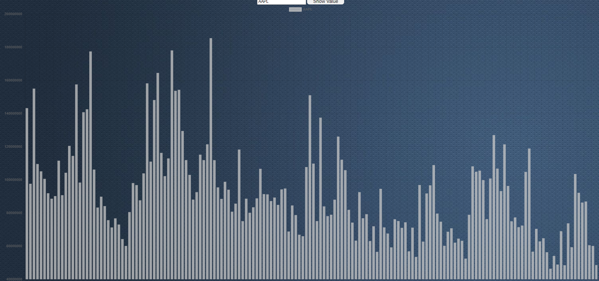

# BHU-Team4

## Tools & Technologies
* *HTML*        -      For basic dashboard structure
* *CSS*         -      For styling dashboard structure
* *Javascript*  -      For interacting with *JSON*

## *Instructions* 
<dl>
<dd>1. Type the company name in the search bar in the the search box and click on search to search for it. </dd>
</dl>
<dl>
<dd>2. The graph is then plotted of the searched query with volume and date. </dd>
</dl>
<dl>
<dd>3. Click on history to see the searched queries. </dd>
</dl>

## *Dependency*
    We need LIve Server in VS Code 
    Link : https://marketplace.visualstudio.com/items?itemName=ritwickdey.LiveServer
##  Graph

